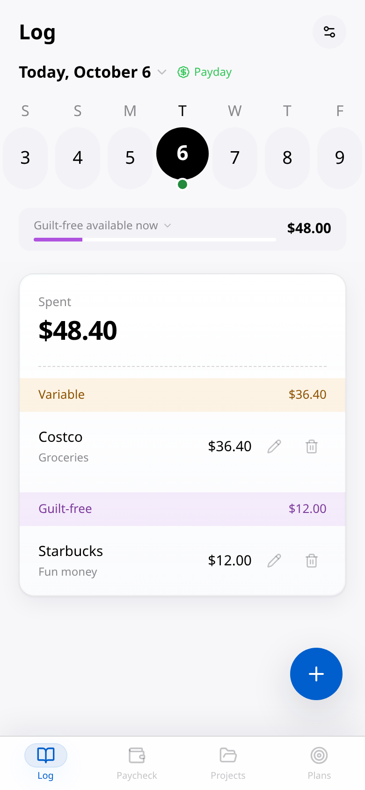
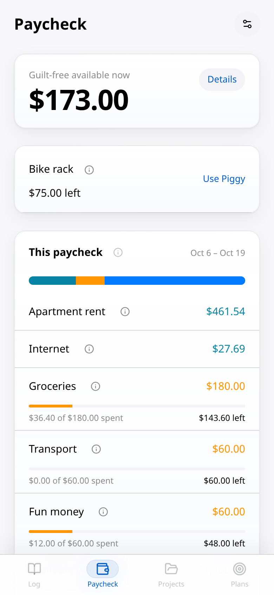
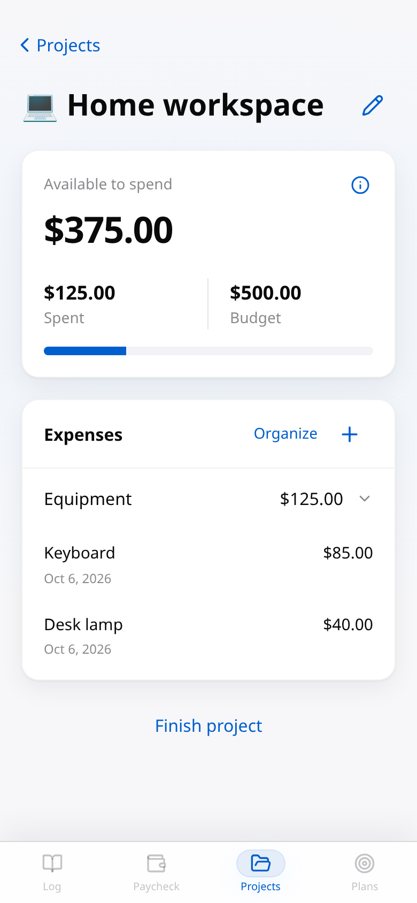
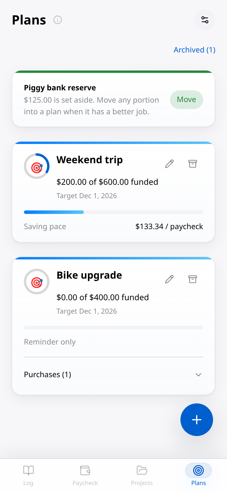
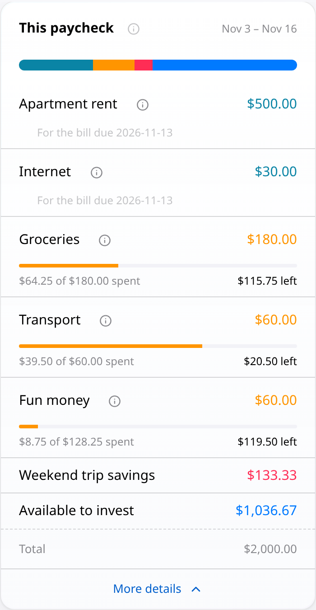
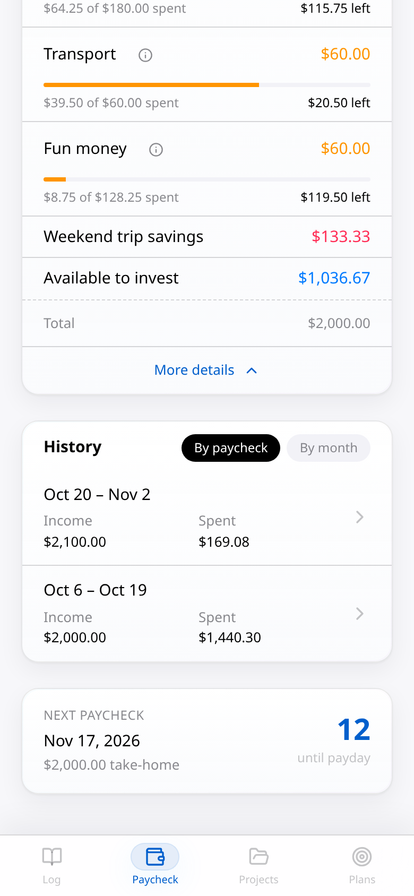

# Jing’s Finance App

Enjoy your life now, plan for your future, and know where each paycheck is going.

Jing’s Finance App helps you reserve money for bills, track everyday spending, save for purchases, recover unexpected expenses, and see what remains available to invest. It is a self-hostable personal finance app with manual entry.

## Why I built it

I’m conscious about what I spend, and I also want to invest consistently for my future. I don’t want to spend a lot of time deciding how much to invest every payday. I want to account for my expenses, set aside money for the things I want to do, and understand what is left.

Without a record, I end up asking myself: Did I spend too much? Did I forget a bill? How much can I put toward retirement without taking money I’ll need before the next paycheck?

I built this app to put those numbers in one place. Paycheck breaks down where my money needs to go, and Log gives me a record of how I actually used it. That helps me make deliberate purchases and investment transfers, with something concrete to look back at instead of trying to remember everything.

My goal is to enjoy life now while being responsible to my future self. Long-term investing and financial independence are part of that goal; this app helps me plan the money I can put toward it.

## Why I’m sharing it

I originally built this for my own finances and the way I want to plan my spending. That includes saving for things I want to do or buy, and recovering money after a surprise expense I’ve already paid.

I’m sharing it in case someone with a similar mindset or situation finds it useful too. It reflects my own needs and habits, so it may not be the right fit for everyone. If it helps you keep track of your money and feel clearer about your decisions, I’d like to hear about it.

## What it helps you work out

### Where each paycheck needs to go

A paycheck has several jobs before the next one arrives: bills, groceries, gasoline, fun money, saving, and any expenses that still need funding. Paycheck puts those commitments into a breakdown before showing the investment remainder.

For example, spreading a $900 rent payment across two eligible paychecks means reserving $450 from each. The app uses your pay schedule and bill cycle to calculate the reserve. After accounting for bills, envelopes, recovery and payoff commitments, and scheduled saving, it shows what remains available to invest. If the paycheck cannot cover the plan, it shows a shortfall.

### Saving for something coming up

Suppose you’re taking a trip in four months and still need to save $1,200 for it. Create a Plan with the amount, target date, and starting paycheck, then enable Save from paychecks. If there are eight eligible paychecks before the target, the saving pace is $150 per paycheck. The app includes that saving in the paycheck breakdown and records eligible funding when you open Paycheck or Plans.

Projects keeps the related purchases together. For a bike upgrade, you might create a Parts group and record a rack, lights, and replacement tires. You can see what you’ve spent, what funded savings remain, and what still needs future money.

### Handling an unexpected expense

Suppose you reserved $900 for rent and utilities, but the payment is $950 because the utility charge was higher than expected. When you confirm that bill payment in Log, the uncovered $50 becomes a recovery Plan starting next paycheck.

That recovery has priority over new saving and the investment remainder. If there’s enough money available after the earlier commitments, the next paycheck covers the $50; otherwise, the remaining balance continues to need funding. A larger surprise purchase can also have a payoff or recovery Plan that carries across future paychecks.

### Giving leftover money its next job

Suppose a finished Project has $375 of unused funded savings. Finishing it releases that money for reassignment. You might put $125 in Piggy reserve and $250 toward investment, or direct some of it to a spending envelope you’ve created, such as Groceries or Fun money.

Money waiting for a decision remains visible as an amount to assign. Its source stays attached to the allocation, so you can follow where it came from and where it went.

### Seeing the plan and what actually happened

An investment suggestion and a recorded investment transfer are separate. If the app suggests $500 and you actually transfer $400, record $400; the app keeps both numbers visible. Recording a transfer does not move money for you.

History lets you revisit earlier paychecks and review income and spending by month. The record helps answer the questions that started this project: where did my money go, and what did I actually do with it?

## A typical day

Open Log and enter a purchase with any useful description: Costco, dinner with mom, or something else that will help you remember it. Choose its spending envelope to keep the category and remaining allowance clear. Check Paycheck to see what remains available. For a larger purchase, review its Plan and keep related expenses together in Projects.

At the next payday, eligible saving and funding catch up when you open Paycheck or Plans. Reset envelopes release positive leftovers, while accumulating envelopes keep theirs. Your saved timezone determines the dates and paycheck boundaries throughout the app.

## Main views

| View | Use |
| --- | --- |
| Log | Record daily purchases, income, bill payments, and notes. |
| Paycheck | See funding priorities, discretionary money, pending allocations, investment suggestions, and history. |
| Projects | Organize purchases under a Plan and release proven unused savings when finished. |
| Plans | Set saving targets and review saving, payoff, and recovery progress. |
| Settings | Manage pay, bills, envelopes, timezone, and account access. |

Supported schedules are weekly, biweekly, semimonthly, and monthly. Dates follow the saved IANA timezone. The interface is English and amounts are USD.

## Preview

All records and amounts in these screenshots are fictional. They were captured from the running app with a separate local account at different stages of the walkthrough. The main screens follow the app’s bottom navigation order.

| Log | Paycheck | Projects | Plans |
| --- | --- | --- | --- |
|  |  |  |  |

Paycheck details and history after advancing through later paydays:

| Full paycheck breakdown | Paycheck history |
| --- | --- |
|  |  |

Try the [interactive demo](https://jings-finance-demo.vercel.app/demo), where each visitor starts with their own made-up records, or explore the [fictional walkthrough with screenshots](docs/DEMO.md). Use fictional information in the demo. Read the [user guide](docs/USER_GUIDE.md) for everyday use, or follow [demo hosting](docs/DEMO_HOSTING.md) to host a demo yourself.

## What this app doesn’t do

This is a manual planning and tracking app. It has no bank or brokerage connections, automatic transaction imports, or automated investment transfers or trades. You enter the information, make payments and transfers yourself, and record what happened.

It calculates a planning remainder from the income, expenses, commitments, and starting savings you enter. It does not choose investments, forecast portfolio returns, or calculate when you can retire. Keeping the records complete is what makes the breakdown useful.

## Your installation and your data

You host the app and configure your own Supabase project. Your financial records are stored in that project, and the app connects to it for authentication and data storage. Access to financial records is scoped to the signed-in account. Your personal financial records and environment credentials are not part of the code published on GitHub.

There is no built-in financial-data reporting to the app’s author. Your hosting and database providers operate the infrastructure you choose; self-hosting includes configuring access, keeping credentials private, and maintaining backups. See [installation](docs/INSTALL.md) and the [release audit](PUBLIC_RELEASE_AUDIT.md) for setup and verification details.

## Run your own copy

Requirements: Node.js 24, npm, and a fresh Supabase project with email/password Auth. Linux and WSL users with nvm can run `nvm install` and `nvm use` in the repository to select its Node version.

1. Clone your copy of the repository and run `npm ci`.
2. Create a fresh Supabase project, keeping email confirmation enabled.
3. Copy `.env.example` to `.env.local` and set the project URL, public anon/publishable key, and server-only PostgreSQL connection string.
4. Run `npm run db:setup` once against that blank project.
5. Configure the Auth Site URL and callback allowlist, including `http://localhost:3000/auth/callback` for local use.
6. Run `npm run dev`, open `http://localhost:3000/signup`, confirm the email, and complete onboarding.

For a local production build, run `npm run build` followed by `npm start`. Hosted installations need their own environment variables, HTTPS, Auth origins, and email delivery configuration. See [full installation instructions](docs/INSTALL.md), including Supabase certificate trust and password-reset templates.

Existing installations receiving application-only updates keep their database and environment configuration. Do not rerun the fresh database setup over an existing installation.

## How the money is tracked

Bills, envelopes, recovery, and scheduled saving are reserved before showing the investment remainder. Reset and accumulating envelopes have different rollover behavior. Project completion releases only proven unused saved money; allocations retain their funding source. See [accounting rules](docs/ACCOUNTING.md) for the exact calendar and funding conventions.

## Use it on your phone

I built this around using it on my iPhone, and that’s where I’ve done my hands-on testing. Android and other devices have had less hands-on testing, so you may encounter differences or bugs.

After hosting your copy over HTTPS, open it in your phone’s browser and add it to your home screen. On iPhone, open the site in Safari, tap Share, and choose Add to Home Screen. If Safari shows an Open as Web App option, leave it enabled. It opens in its own app-style window, with no App Store download. Other supported browsers offer an Install or Add to Home Screen option.

## Development

Built with Next.js, React, TypeScript, Supabase Auth, and PostgreSQL.

```sh
npm ci
npm test
npm run typecheck
npm run lint
npm run build
```

Browser verification uses disposable localhost services and fictional identities. See [testing](docs/TESTING.md) and [calendar verification](docs/DATE_TESTING.md). The [release audit](PUBLIC_RELEASE_AUDIT.md) records the completed checks and remaining hosting limitations.

## License

[MIT](LICENSE), copyright 2026 IndexDuo.
