# A walkthrough with made-up money

Try the [live demo](https://jings-finance-demo.vercel.app/demo) without an email or password. **Start demo** opens Log with your own copy of the example records. You can change them and explore the app. Other visitors get their own copies.

The screenshots below show a separate example built through the app, from setup to later paydays. Its dates and amounts differ from the live demo. All of its money is made up.

## The example budget

The opening screenshots use October 6, 2026, with the next rent and Internet payments due October 13. The later screenshots go through November 5.

| Setup | Fictional value |
| --- | --- |
| Take-home | $2,000 every two weeks |
| Apartment rent | $1,000 monthly; next due seven days after setup |
| Internet | $60 monthly; next due seven days after setup |
| Groceries | $390 monthly; Variable; release leftovers each paycheck |
| Transport | $130 monthly; Variable; release leftovers each paycheck |
| Fun money | $130 monthly; Guilt-free; keep leftovers in the envelope |

With this budget, the opening paycheck sets aside $180 for Groceries, $60 for Transport, and $60 for Fun money. The app spreads monthly budgets across 26 paychecks a year; see [the money rules](ACCOUNTING.md#why-a-monthly-amount-is-not-always-split-in-half) for the math.

## 1. Set up a personal copy

A personal copy starts with signup and setup. Enter pay, timezone, bills, and envelopes. The live demo has already done this for you.

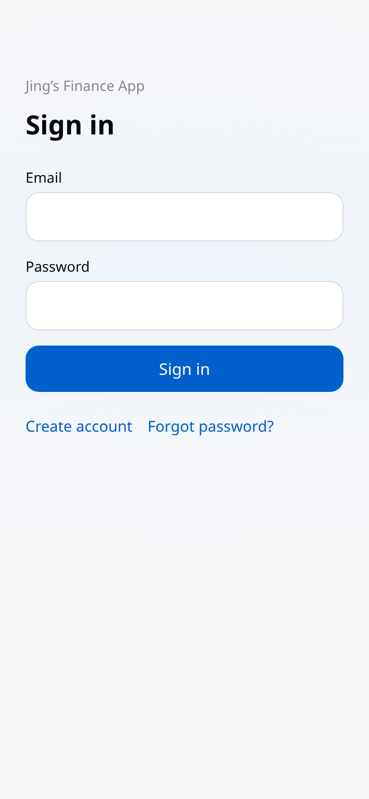
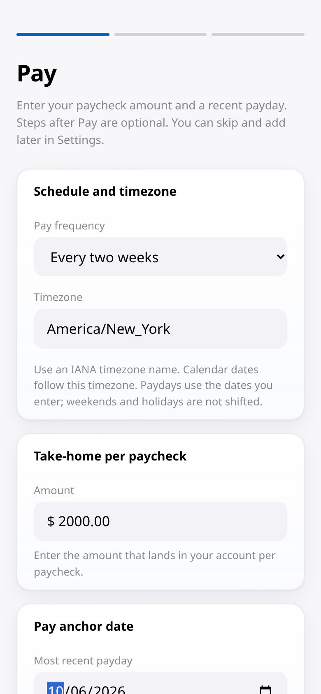

## 2. See what the paycheck can cover

Paycheck shows where the money needs to go and what is left to invest. Guilt-free available now starts with $60 from Fun money. Open **More details** to see the extra rows.

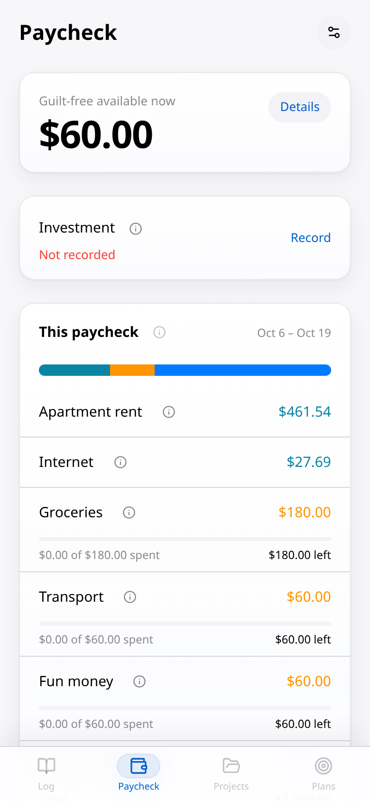

## 3. Record everyday spending

In Log, add $36.40 to Groceries with the description Costco, then $12 to Fun money with the description Starbucks. Use any description you will recognize. The envelope already tells the app what kind of spending it is. Review each formatted amount before saving. Fun money now has $48 left.

## 4. Give saved money a purpose

In Plans, create these three examples. Set their target dates eight weeks after setup.

Open Appearance in each Plan form to choose its icon and color.

| Plan | Icon / color | Target | Already saved | Save from paychecks |
| --- | --- | --- | --- | --- |
| Weekend trip | ✈️ / Lilac | $600 | $200 | On; start with the next paycheck |
| Home workspace | 💻 / Ocean | $500 | $500 | Off |
| Bike upgrade | 🚲 / Sunset | $400 | $0 | Off |

Weekend trip shows how much to save each eligible payday. Already saved means money set aside before creating the Plan. Home workspace has its full $500 saved, so its progress bar is green.

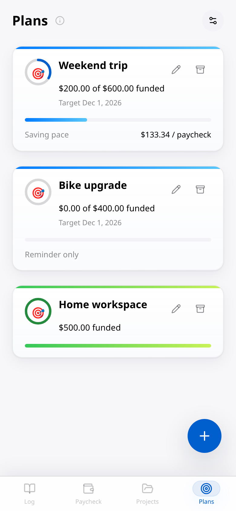

## 5. Buy within a funded Project

In Projects, choose Add project and select Home workspace. Open Organize, choose Add group, enter Equipment, and select Done. Record a Keyboard for $85 and a Desk lamp for $40, choosing Equipment in each purchase form. The $500 already saved covers both purchases, leaving $375 available.

## 6. See a purchase that needs future money

Add Bike upgrade as another Project and use Organize to create a Parts group. Enter a $75 Bike rack and choose Parts in the purchase form. Before saving, the form shows that $75 needs future paychecks. After saving, the Project still shows that need. Choosing a later date does not turn this purchase into an already-funded one.

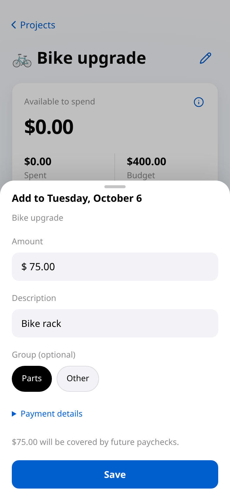
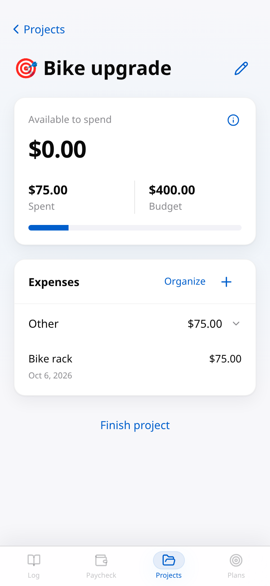

## 7. Finish the funded Project

Return to Home workspace and choose Finish project. Review $125 spent and $375 ready to reallocate, then choose Finish and release. Paycheck now shows the $375 waiting to be assigned. The bike still needs its own future money.

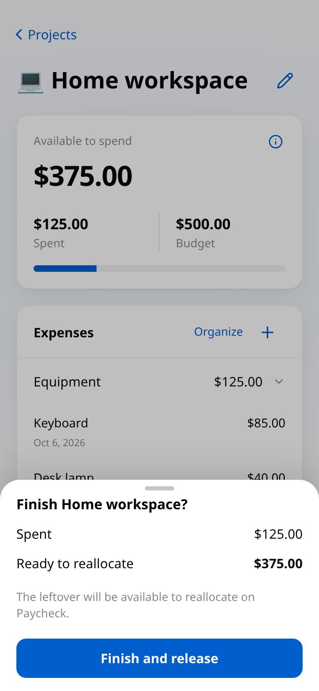

## 8. Choose where the released money goes

Open the $375 waiting to be assigned on Paycheck. Allocate $125 to Piggy reserve and the remaining $250 to Investment. Review the split and confirm. The app keeps a record that this money came from finishing the workspace.

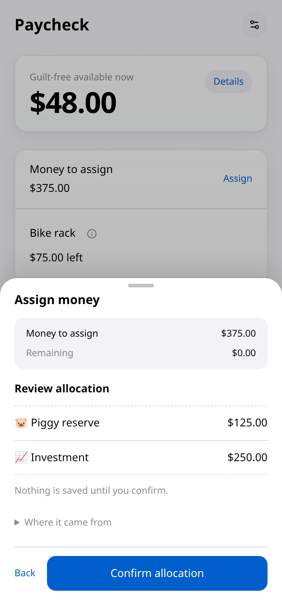

## 9. Record the transfer you actually made

Under Investment, choose Record and enter an actual transfer of $80. The investment suggestion remains a separate planning number. Piggy reserve raises the Guilt-free available now total to $173: $48 in Fun money plus $125 assigned to Piggy.

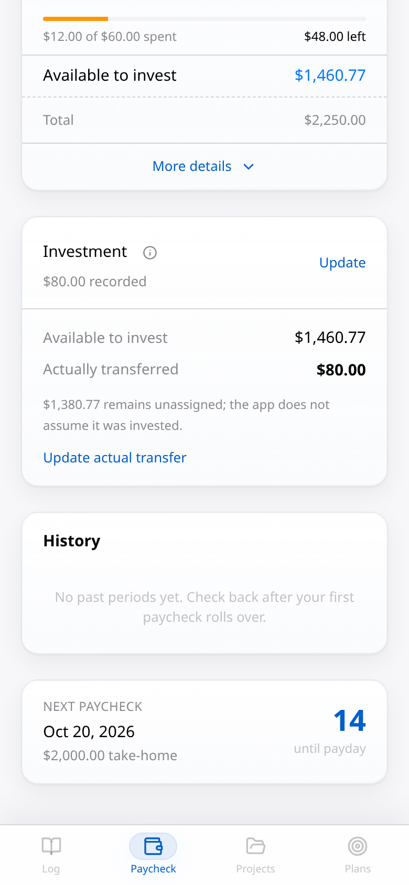

## 10. Review what remains

Settings shows the same pay, bills, and envelopes entered during setup. Because this account has already used money, bill and envelope changes start next paycheck. An unused paycheck can be changed right away. Projects keeps the completed workspace separate from the active bike upgrade, and Plans keeps the remaining saving and funding needs visible.

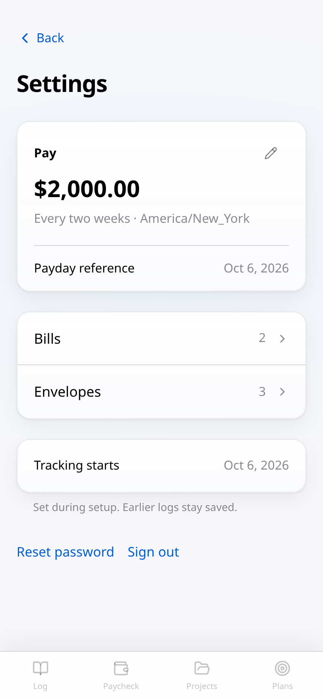
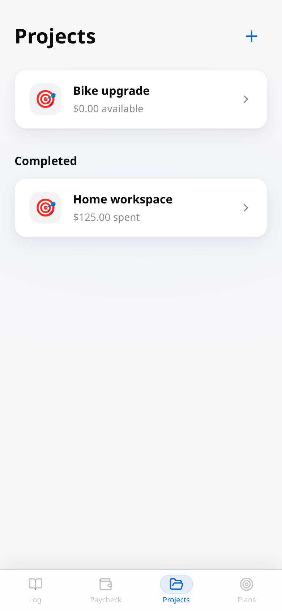

## Follow the account across paydays

The same example continues from October 6 through November 5. These screenshots show what later spending and paydays add to History. The app has no button for changing its clock.

| Date | Added activity |
| --- | --- |
| October 7 | Sam’s Club $88.15 in Groceries, Shell $38 in Transport, Dunkin’ $5.75 in Fun money. |
| October 13 | Confirm Apartment rent $1,000 and Internet $60 on their due date. |
| October 20 | A new paycheck; Walmart $54.23, Shell $42, AMC $18, $100 income from Facebook Marketplace, and a $400 actual investment transfer. |
| October 25 | ALDI $24.85, Uber $14, AMC $16. |
| November 3 | Another paycheck; the app records eligible saving and funding. |
| November 5 | Costco $64.25, Shell $39.50, Starbucks $8.75. |

The expanded breakdown shows where the November paycheck goes. History contains October 6–19 and October 20–November 2, with income and spending for each. **By month** brings the October activity together. The $80 and $400 investment records stay with their own paychecks.

| History period | Income | Spending |
| --- | --- | --- |
| October 6–19 | $2,000.00 | $1,440.30 |
| October 20–November 2 | $2,100.00 | $169.08 |
| October by month | $4,100.00 | $1,609.38 |

After two scheduled contributions, Weekend trip has $466.67 saved. Opening the pages again does not add the same saving twice.

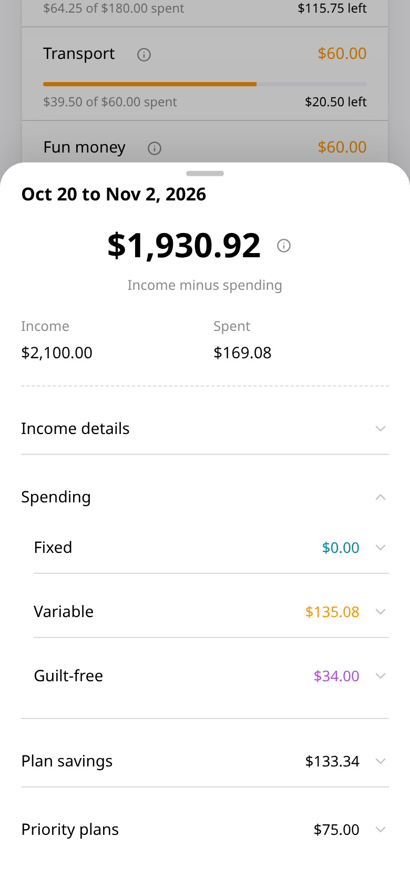
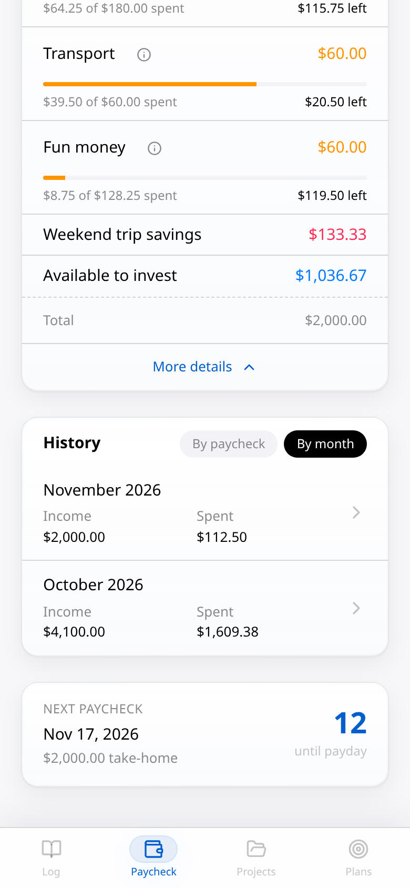
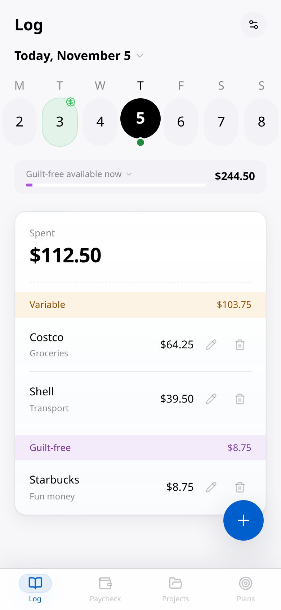
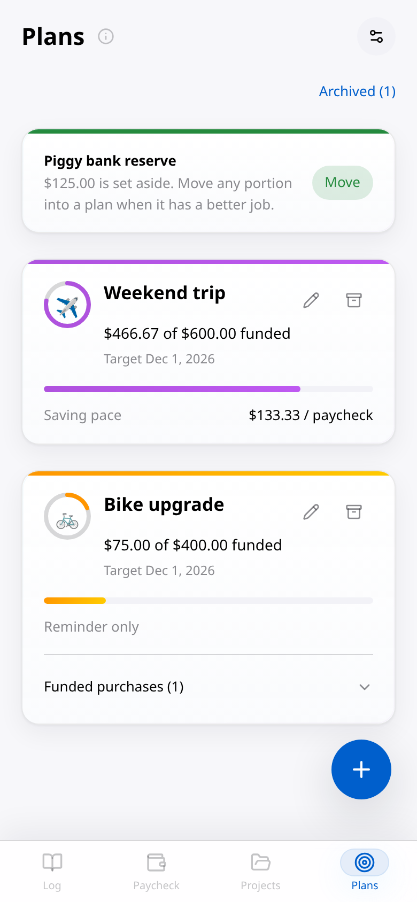
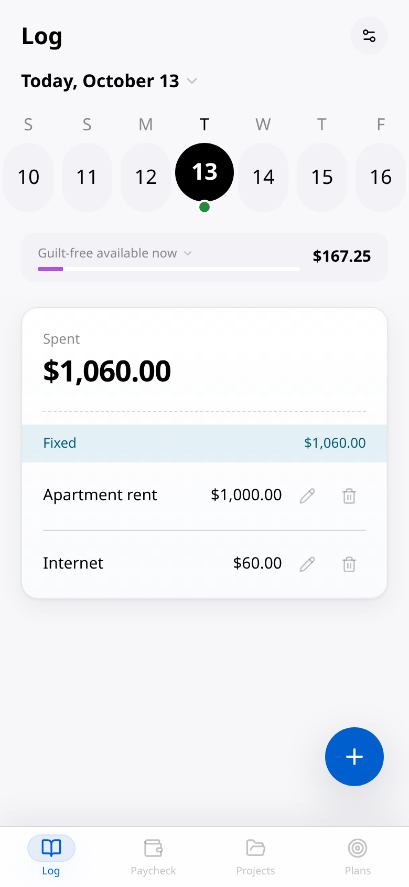

These pictures keep their capture dates. Your app continues with the current date in your saved timezone. Read [the user guide](USER_GUIDE.md) for daily use.

## Recreate this example in your own test copy

Use a separate empty [personal installation](INSTALL.md) and a new account. Leave demo mode unset; ordinary setup does not add sample records. Enter the budget above through the forms, then follow the steps. If you start later, move the bill and Plan dates forward too. Keep example money separate from your personal records.

To run a public demo where every visitor gets a copy, see [demo hosting](DEMO_HOSTING.md). People changing date behavior should read [testing](TESTING.md#recorded-date-checks).
